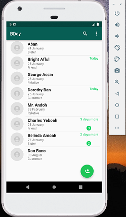
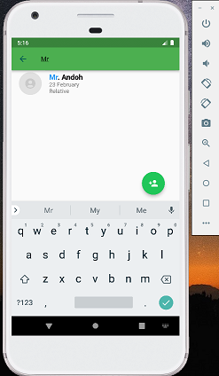
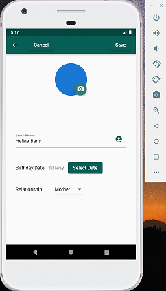
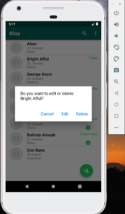
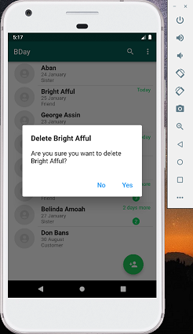

# BDAY APP
#### video Demo: <https://youtu.be/aUNDtUalD1I>
#### Description:
This App is called BDay. The App helps the user to remember the birthday date of loved ones.
The user have the option to store information such as name, birthday date and the relationship 
between person they wish to remember their birthday date and the user.
The App will then indicate to the User, a person's birthday, starting from three days to a person's birthday.

Features:
 * Home Page: It displays list of persons whose information has been stored, and instances where there is
   three or fewer days to a person's birthday, there is indication to the User on the home page. 
     
 
    
      

 * Search Bar: It allows the User to search through the list of persons stored. In instance where 
   the person the user search for, is not in the list, the result of search will notify the user that 
   such person was not found in the list.
     

    
      
 
   * Add Button: It allows the User to add new person to the list of persons. Basically, when
     the add button is clicked, the User is directed to a new page where he or she has a simple 
     form to input information about the person he or she likes to add to the list. Such information
     include the name, birthday date, relationship with the user and optionally a photo of the person.
       

      
       

 * LongPress Person Item: Allows User to edit or delete a person's information. So on pressing a person item
   for some few seconds, the user is present with an alert dialog which indicate to the User whether he or 
   she like to either edit or delete the current information of the person or cancel the action. For instances where
   the delete button is clicked on the alert dialog after long-pressing on the person item, the User is further 
   asked whether he or she is sure to delete that person's information, before the action is granted.
     
    
    
     

Technologies Used:
The project is created using;
* Flutter - A development environment Kit of the app. It is an open-source UI created by Google.
  It is used to develop cross-platform applications for Android, iOS, Linux, macOS, windows, 
  Google Fuchsia and the web from a single codebase. 

* Sqflite - A flutter SQL database engine for SQLite (used for lightweight database management). 
  It supports transactions and batches, automatic version management during open, helpers for insert,
  query, update and delete queries. It also helps DB operation executed in a background thread on 
  iOS and Android. 

* Intl - A flutter library for date and number formatting and parsing. It contains code to deal
  with internationalized/localized messages, bi-directional text and other internationalization 
  issues. 

* Path - A flutter library which is string-based path manipulation. It provides common operations for 
 manipulating paths: joining, splitting, normalizing and has a solid support for Windows, Linux,
 Mac Os and the Web. 

* Fluro - A flutter library for handling routing. It adds flexible routing options like
  wildcards, named parameters and clear route definitions.
 
 

Note:  
This project is a final project for CS50 Introduction to Computer Science course.

About CS50:  
CS50 is an openware course from Havard University and taught by David J. Malan.
Introduction to the intellectual enterprises of computer science and the art of 
programming.  
This course teaches students how to think algorithmically and solve 
problems efficiently. Topics include abstraction, algorithms, data structures, 
encapsulation, resource management, security and software engineering.
Languages include C, Python, SQL and Javascript plus CSS and HTML.

